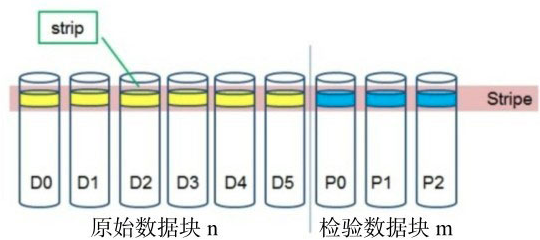

# 第一部分 核心设计篇

## 第1章 HDFS的数据存储

HDFS的数据存储包括两块：一块是HDFS内存存储，另一块是HDFS异构存储。

- HDFS内存存储是一种十分特殊的存储方式，将会对集群数据的读写带来不小的性能提升
- HDFS异构存储则能帮助我们更加合理地把数据存到应该存的地方

### 1.1 HDFS内存存储

HDFS内存存储策略：LAZY_PERSIST 直接将内存作为数据存放的载体

可以这么理解，此时节点的内存也充当了一块“磁盘”。只要将文件设置为内存存储方式，最终会将其存储在节点的内存中。

#### 1.1.1 HDFS内存存储原理


异步存储的大体步骤：

1. 对目标文件目录设置StoragePolicy为LAZY_PERSIST的内存存储策略
2. 客户端进程向NameNode发起创建/写文件的请求
3. 客户端请求到具体的DataNode后DataNode会把这些数据块写入RAM内存中，同时启动异步线程服务将内存数据持久化写到磁盘上。

#### 1.1.2 Linux 虚拟内存盘

虚拟内存盘（RAM disk）

这是一种模拟的盘，实际数据都是存放在内存中的。虚拟内存盘可以在某些特定的内存式存储文件系统下结合使用，比如tmpfs、ramfs。

通过此项技术，我们就可以将机器内存利用起来，作为一块独立的虚拟盘供DataNode使用了。

#### 1.1.3 HDFS的内存存储流程分析

##### 1. HDFS文件内存存储策略设置

设置存储策略的方法目前有以下3种：

- 通过命令行的方式，调用如下命令。这种方式比较方便、快速。

```
hdfs storagepolicies -setStoragePolicy -path <path> -policy LAZY_PERSIST
```

- 调用对应的程序方法，比如调用暴露在外部的create文件方法，但是得带上参数`CreateFlag.LAZY_PERSIST`

```
    FSDataOutputStream fos =
        fs.create(
            path,
            FsPermission.getFileDefault(),
            EnumSet.of(CreateFlag.CREATE, CreateFlag.LAZY_PERSIST),
            bufferLength,
            replicationFactor,
            blockSize,
            null);
```

- 通过FileSystem的setStoragePolicy方法（2.8.0+）

```
fs.setStoragePolicy(path, "LAZY_PERSIST");
```

##### 2. LAZY_PERSIST内存存储


- RamDiskAsyncLazyPersistService：

  异步持久化线程服务，针对每一个磁盘块设置一个对应的线程池，需要持久化到给定磁盘的数据块会被提交到对应的线程池中去。每个线程池的最大线程数为1。

- LazyWriter：

  这是一个线程服务，此线程会不断地从数据块列表中取出数据块，将数据块加入到异步持久化线程池RamDiskAsyncLazyPersistService中去执行。

- RamDiskReplicaLruTracker：

  是副本块跟踪类，此类中维护了所有已持久化、未持久化的副本以及总副本数据信息。所以当一个副本被最终存储到内存中后，相应地会有副本所属队列信息的变更。当节点内存不足时，会将最近最少被访问的副本块移除。

  （代码解析略）

#### 1.1.4 LAZY_PERSIST内存存储的使用

1. 配置虚拟内存盘
2. 将机器中已经完成好的虚拟内存盘配置到dfs.datanode.data.dir中，并带上RAM_DISK标签
3. 设置具体的文件策略类型

### 1.2 HDFS异构存储

异构存储可以根据各个存储介质读写特性的不同发挥各自的优势，如冷热分离。

#### 1.2.1 异构存储类型

RAM_DISK：内存存储（LAZY_PERSIST）

SSD：固态硬盘存储

DISK：机械盘存储（默认）

ARCHIVE：主要指的是高密度存储介质，用于解决数据扩容的问题

HDFS并没有自动检测识别的功能，需要在配置属性时主动声明。

配置属性dfs.datanode.data.dir可以对本地对应存储目录进行设置，同时带上一个存储类型标签：

```
[SSD]file:///grid/dn/ssd0
```

#### 1.2.2 异构存储原理

HDFS异构存储可总结为以下三点：

- DataNode通过心跳汇报自身数据存储目录的StorageType给NameNode。
- 随后NameNode进行汇总并更新集群内各个节点的存储类型情况。
- 待复制文件根据自身设定的存储策略信息向NameNode请求拥有此类型存储介质的DataNode作为候选节点。

（代码解析略）

#### 1.2.3 块存储类型选择策略

当前存储类型不可用的时候，退一级选择使用的存储类型

#### 1.2.4 块存储策略集合

根据冷热数据的角度区分：

- HOT
- COLD
- WARM

根据存放盘的性质区分：

- ALL_SSD
- ONE_SSD
- LAZY_PERSIST

#### 1.2.5 块存储策略的调用

HDFS的默认策略是 `HOT`，HDFS把集群中的数据都看成是经常访问的数据。

DN上存储的策略ID从何而来：

- 通过RPC接口主动设置
- 没有主动设置的ID会继承父目录的策略
- 如果父目录还是没有设置策略，则会设置ID_UNSPECIFIED，继而会用DEFAULT（默认）存储策略进行替代

#### 1.2.6 HDFS异构存储策略的不足之处

目前HDFS上还不能对文件目录存储策略变更做出自动的数据迁移。这里需要用户额外执行`hdfs -mover`命令做文件目录的扫描。在mover命令扫描的过程中，如果发现文件目录的实际存储类型与其所设置的storagePolicy策略不同，将会进行数据块的迁移，将数据迁移到相对应的存储介质中。

#### 1.2.7 HDFS存储策略的使用

```
hdfs storagepolicies
- setStoragePolicy
- listPolicies
- getStoragePolicy
```

最简单的使用方法是：

1. 事先划分好冷热数据的存储目录，设置好对应的存储策略
2. 使用相应的程序在对应分类目录下写数据，自动继承父目录的存储策略

在较新版的Hadoop发布版本中增加了数据迁移工具。此工具的重要用途在于它会：

```
hdfs mover
```

1. 扫描HDFS上的文件，判断文件是否满足其内部设置的存储策略
2. 如果不满足，就会重新迁移数据到目标存储类型节点上

## 第2章 HDFS的数据管理与策略选择


### 2.1 HDFS缓存与缓存块

HDFS缓存的出现可以大大提高用户读取文件的速度，因为它是缓存在DataNode内存中的，此过程无需进行读取磁盘的操作。

在HDFS中缓存的对象是数据块，需要缓存的目标数据块称为CacheBlock，不需要缓存的数据块称为UnCacheBlock。

#### 2.1.1 HDFS物理层面缓存块

利用mmap、mlock这样的系统调用将块数据锁入内存，以此达到在DataNode上缓存数据的效果。

- mmap：mmap系统调用，它是一个内存映射调用。mmap主要作用是将一个文件或者其他对象映射进内存。

#### 2.1.2 缓存块的生命周期状态

在HDFS的缓存过程中有这四类缓存状态，并可以切换。

- CACHING：表示块正在被缓存
- CACHING_CANCELLED：正在被缓存的块已处于被取消的状态
- CACHED：表明数据块已被缓存
- UNCACHING：表明缓存块正处于取消缓存的状态

#### 2.1.3 CacheBlock、UnCacheBlock场景触发

##### 1. CacheBlock动作

- 此方法最终来自于NameNode心跳处理的方法


##### 2. UnCacheBlock动作

- 当块执行append写操作时

  因为对块继续执行了写动作，数据必然发生改变，原有的缓存块需要重新更新

- 当把块处理为无效块时

  当把块处理为无效块的时候，接着会被NameNode从系统中清除，缓存块自然而言就没有存在的必要了

- 上层NameNode发送uncache回复命令时


#### 2.1.4 CacheBlock、UnCacheBlock缓存块的确定

NameNode中的CacheReplicationMonitor自身持有一个系统中的标准缓存块列表，通过自身内部的缓存规则，进行缓存块的添加和移除，然后对应更新到之前提到过的pendingCache和pendingUncache列表中，随后这些信息会被NameNode拿来放入回复命令中。

##### CacheReplicationMonitor内部缓存规则

- 任何少于标准副本块个数的副本应该被缓存到新的节点上
- 过量副本数的缓存块应该从节点上进行移除

#### 2.1.5 系统持有的缓存块列表如何更新

因为缓存块列表是系统全局持有的，会存在反馈上报的过程，相关逻辑位于心跳处理部分。

缓存块的更新形成一个闭环。

#### 2.1.6 缓存块的使用

#### 2.1.7 HDFS缓存相关配置

```
    <property>
      <name>dfs.datanode.max.locked.memory</name>
      <value>0</value>
      <description>
      DataNode用来缓存块的最大内存空间大小，单位用字节表示。系统变量 RLIMIT_MEMLOCK 至少需要设置得比此配置要大，否则DataNode会出现启动失败的现象。在默认情况下，此配置值为0，表名默认关闭内存缓存的功能。
      </description>
    </property>
```

其他配置：

- `dfs.datanode.fsdatasetcache.max.threads.per.volume	：用于缓存块数据的最大线程数，这个线程数是针对每个存储目录而言，默认值为4
- `dfs.cachereport.intervalMsec`：缓存块上报间隔，默认10秒

注意：

- 此配置项会受系统最大可使用内存大小（RLIMIT_MEMLOCK）的影响，造成启动DataNode失败的现象

  可以通过`ulimit -l <value>`命令对此进行调整

- 此配置项并不是HDFS缓存机制所独有的，它与HDFS的LAZY_PERSIST策略会共享`dfs.datanode.max.locked.memory`配置

### 2.2 HDFS中心缓存管理

HDFS中心缓存管理机制主要依赖于中心缓存管理器（CacheManager）以及缓存块监控服务（CacheReplicationMonitor）。通过二者的协作，来控制集群缓存块的状态。

#### 2.2.1 HDFS缓存适用场景

- 缓存HDFS中的热点公共资源文件

  如：依赖资源 jar 包，或是一些算法学习依赖的 .so 文件等

- 缓存短期临时的热点数据文件

  如：集群中每天运行统计的报表数据，需要读取前一天的或是最近一周的数据做离线分析

#### 2.2.2 HDFS缓存的结构设计


在HDFS中，最终缓存的本质是数据文件。但是在逻辑上，引入了下面几个概念。

##### 1. CacheDirective

CacheDirective是缓存的基本单元，但是这里CacheDirective不一定针对的是一个目录，也可以是一个文件。

##### 2. CachePool

缓存池中维护了一个缓存单元列表。同时这些缓存池被CacheManager所掌管，CacheManager在这里就好比一个总管理者的角色。

#### 2.2.3 HDFS缓存管理机制分析

CacheManager通过:

- id到CacheDirective

- 路径到CacheDirective列表

  对同一个缓存路径是可以被多次缓存的

- 名称到CachePool

的多个映射关系，使得原本逻辑上的父子关系结构平级化了，方便了多条件地灵活查询。

*比如说我们通过id去找对应的缓存对象，就不需要重新遍历查找了。*

##### 1. CacheAdmin CLI命令在CacheManager的实现

CacheAdmin是HDFS中缓存块的管理命令。在CacheAdmin中的每个操作命令，最后通过RPC调用都会对应到CacheManager中的一个具体操作方法。

##### 2. CacheReplicationMonitor缓存监控服务

（略）


缓存副本块的监控服务，循环执行扫描、统计、重排等逻辑

1. resetStatistics重置统计变量计数值

   因为要进行完全新一轮的缓存过程，所以CachePool以及其所包含的CacheDirective都要重新计数

2. rescanCacheDirectives

   扫描之前保存在CacheManager中的那些CacheDirectives

3. rescanCachedBlockMap

#### 2.2.4 HDFS中心缓存疑问点

两个JIRA，略

#### 2.2.5 HDFS CacheAdmin命令使用


### 2.3 HDFS快照管理

Snapshot

#### 2.3.1 快照概念

快照不是数据的简单拷贝，快照只做差异的记录

因为不保存实际的数据，所以快照的生成往往非常迅速

对于大多不变的数据，你所看到的数据其实是当前物理路径所指的内容，而发生变更的INode数据才会被快照额外拷贝，也就是前面所说的差异拷贝。

#### 2.3.2 HDFS中的快照相关命令

```
$ hadoop fs
  Usage: hadoop fs [generic options]
      [-createSnapshot <snapshotDir> [<snapshotName>]]     // 在指定快照目录下创建快照
      [-deleteSnapshot <snapshotDir> <snapshotName>]       // 在指定快照目录下删除快照
      [-renameSnapshot <snapshotDir> <oldName> <newName>]  // 在指定快照目录下重命名某快照

$ hdfs
  Usage: hdfs [--config confdir] [--loglevel loglevel] COMMAND
      where COMMAND is one of:
          snapshotDiff           // 比较两个快照之间的不同或是比较当前内容与某快照之间的不同
          lsSnapshottableDir     // 列出所属当前用户的所有的快照目录
```

一个快照目录下可以有多个快照文件，快照目录可以创建、删除自身目录下的快照文件，同时快照目录本身又被快照目录管理器所管理。

#### 2.3.3 HDFS内部的快照管理机制

##### 1. 快照结构关系

- 快照管理器管理多个快照目录
- 一个快照目录拥有多个快照文件

##### 2. 快照调用流程

SnapshotManager负责接收快照操作请求，继而调用相关类进行处理


##### 3. 快照原理实现分析

创建快照之前，需要对目标目录执行allowSnapshot操作，使得对目录能够有创建快照的权限

会在快照目录下的隐藏目录 ./snapshot 下创建目标快照

注意：不允许创建出网状关系（NestedSnapshots）的快照目录，就是目标快照目录的子目录和父目录不能够同样为快照目录

计数：

- 每次新增快照时，Counter计数会加1，然后做计数判断，这里的MaxSnapshotID指的是上限值：1<<24 - 1
- 在每个目录下又会有快照总数的限制：1<<16

获取快照的数据：

- 如果当前快照id不是Snapshot.CURRENT_STATE_ID，则从对应的快照中获取结果，否则从当前的目录中获取结果

最终的孩子列表是通过将diff发生过变更的INode信息与原目录节点信息进行结合，然后将一个新的子节点信息作为最终结果返回。diff中保留的INode就是当时快照创建时的INode信息。

- HDFS中只为每个快照保存相对当时快照创建时间点发生过变更的INode信息，只是“存不同”
- 获取快照信息时，根据快照Id和当前没发生过变更的INode信息，进行对应恢复

快照之间的比差异功能对于使用者来说是非常实用的功能。因为通过比较不同时间点创建的快照，我们可以知道在此期间到底哪些文件目录被修改、创建或删除，甚至还能通过这些差异数据做元数据同步。

（diff的代码实现，略）

#### 2.3.4 HDFS的快照使用

- 丢失数据的恢复

  这里丢失数据指的是相对于创建快照时间点之后丢失的数据

- 元数据的差异比较

  HDFS的快照能够提供diff比较的功能。比较的结果会展示相对于源端快照，目标快照中发生的文件目录的变更记录。这个差异结果可以用于数据的同步，比如快照在DistCp命令中的使用。比如用于实现集群数据间的同步。

### 2.4 HDFS副本放置策略(BlockPlacementPolicy)

一个文件块的落盘过程：

1. 存储类型策略

   -> 筛选一批符合存储类型要求的存储位置列表

2. 副本放置策略

#### 2.4.1 副本放置策略概念与方法

##### BlockPlacementPolicyDefault策略

1. 如果写请求方所在机器是其中一个DataNode，则直接存放在本地，否则随机在集群中选择一个DataNode
2. 第二个副本存放于不同于第一个副本所在的机架
3. 第三个副本存放于第二个副本所在的机架，但是属于不同的节点


#### 2.4.2 副本放置策略的有效前提

如果机架感知功能关闭并不会导致副本放置策略的失败，但是副本放置策略在这种情况下会失效。

```
<property>  <name>net.topology.script.file.name</name>  <value>/path/to/rackAware.py</value></property>
```

#### 2.4.3 默认副本放置策略的分析

##### 策略核心方法chooseTargets

favoredNodes：使得方法在选择节点时候优先选取偏爱节点参数中的节点

1. 初始化操作

2. 选择目标节点

3. 对目标节点列表进行排序，形成Pipeline

   对已经选择好的目标节点存放位置进行排序，然后形成Pipeline进行返回。

   就是从writer所在节点开始，总是寻找相对路径最短的目标节点，最终形成Pipeline。（TSP旅行商问题）

   *就是选出一个源节点，根据这个节点，遍历当前可选的下一个目标节点，找出一个最短距离的节点，作为下一轮选举的源节点。这样每两个节点之间的距离总是最近的，于是整个Pipeline节点间的距离和就能保证是足够小的了*

###### HDFS中节点间的距离

LCA（最近公共祖先算法）


##### chooseTarget方法主逻辑

1. 首节点的选择

   - 如果writer请求方本身位于集群中的一个DataNode之上，则第一个副本的位置就在本地节点上
   - 如果result中还是没有任何节点，则会从集群中随机挑选一个节点作为第一个节点

2. 三副本位置的选取

   如上的pipeline过程

3. 策略函数

   优先级递减：

   chooseLocalStorage

   chooseLocalRack

   chooseRemoteRack

   chooseRandom

#### 2.4.4 目标存储好坏的判断

最后一关：对于存储的验证

条件：

- 存储的存储类型必须是请求的存储类型
- 存储不能是READ_ONLY（只读）
- 存储不能是坏的
- 存储所在节点不应该是已下线或下线中的节点
- 存储所在节点不应该是消息落后的节点，实际指的是一段时间内没有更新心跳的节点
- 节点内保证有足够的剩余空间能满足写块所要求的大小
- 要考虑节点的IO负载繁忙程度
- 要满足同机架内最大副本数的限制

#### 2.4.5 chooseTargets的调用

略

#### 2.4.6 BlockPlacementPolicyWithNodeGroup继承类

在Rack机架层下还多了Node-Group层


#### 2.4.7 副本放置策略的结果验证

我们需要有一种方式能够检测块当前的详细位置，这样我们才能判断是否满足HDFS的副本放置策略

```
 hdfs fsck <path> -files -blocks -locations
```

### 2.5 HDFS内部的认证机制

#### 2.5.1 BlockToken认证

BlockToken认证是基于令牌的块级别粒度的验证

略

#### 2.5.2 HDFS的Sasl认证

Sasl 是一套公开的认证机制，全称是Simple Authentication andSecurity Layer，中文翻译为“简单认证与安全层”，是一种用来扩充C/S模式验证能力的机制。

##### 1. SaslClient与SaslServer的握手

##### 2. DoSaslHandshake

进入真正握手阶段的方法中，会提前一步进行用户、密码的构造过程


##### 3. SaslInputStream和SaslOutputStream的“多余处理”

#### 2.5.3 BlockToken认证与HDFS的Sasl认证对比

##### 共同点

- 没有空间局部的限制，都是数据全局的认证
- 都会对数据读写效率造成一定程度的影响

##### 不同点

- 认证维度不同。

  BlockToken认证的粒度较细，是针对块级别的认证，会对每次的块操作做认证。Sasl则是针对每次数据传输操作做认证。

- 复杂性不同。

  BlockToken的认证过程相对简单、清晰。而Sasl认证体系则复杂一些，会经过握手阶段，而且中间还可以配置相关的认证防护级别（Qop）的参数。论完整度而言，Sasl比BlockToken更加完整化、体系化一些。

### 2.6 HDFS内部的磁盘目录服务

HDFS在DataNode所在的节点中启动了多种磁盘目录的检测服务，来保证数据的完整性与一致性

#### 2.6.1 HDFS的三大磁盘目录检测扫描服务

##### DiskChecker（磁盘）

**坏盘检测服务**。检测的级别是每个**磁盘**，检测的对象是FsVolume, FsVolume对应一个存储数据的磁盘。通过检测文件目录的访问权限以及目录是否可创建来判断目录所属磁盘的好坏，如果是坏盘，则此块盘将会被移除，上面的所有块都将被重新复制。

##### DirectoryScanner（目录）

目录扫描服务，对每块盘上的目录做扫描，使之**与内存中维护的块信息同步**。比如存储在磁盘上的块已经没有了，则内存中的块信息也应该被移除。

##### VolumeScanner（块）

磁盘目录扫描服务。从名称上来看，VolumeScanner与DirectoryScanner比较类似，但是VolumeScanner才是真正意义上的**块检查服务**。它会对已发现的“可疑块”做检查，判断此块是否为损坏块，如果是，则会将其汇报给NameNode。

#### 2.6.2 DiskChecker：坏盘检测服务

DiskChecker服务并不是一个周期性的定时任务，它只会在可能有坏盘出现的场景中被启动，然后执行

##### 1. DiskChecker何时被调用


##### 2. DiskChecker坏盘检测原理

不同的BlockPool在每个盘上的存储是以BP打头的目录做区分的，类似格式如下，其中xx.xx. xx.xx代表的是当时做格式化操作的NameNode的ip地址：

```
BP-805037254-xx.xx.xx.xx-1460537955319
```

检测3类目录：

- finalizedDir目录，已经完成后的块文件存储目录，层级不止一层，子目录下还存在子目录，所以在此处需要递归地检查。
- tmpDir临时目录，存储临时副本的目录。
- rbwDir目录，正在写操作的文件会存放于此目录，写完成之后，会被移入到finalizedDir目录中。

检测过程：

- 创建目录的检测。在这里会通过执行mkdir的方法来判断是否能够创建出目录。
- 访问权限的检测。检测的逻辑是判断目录的是否能够进行读、写和执行。

结果：

- 坏盘被DiskChecker检测出来之后，会在NameNode的50070端口页面中显示出来，集群管理人员看到了可以做后续的处理工作。

##### 3. DiskChecker注意点

- 坏盘检测的误判

- 大量的坏盘导致DataNode启动的失败

  配置：dfs.datanode.failed.volumes.tolerated

#### 2.6.3 DirectoryScanner：目录扫描服务

阶段性扫描块以及块的元数据文件，使之与DataNode内存中维护的数据趋向一致。

##### 1. scan生成diff差异报告

diff差异报告的生成需要同时获取磁盘上的块信息报告和内存中的块信息报告，然后做具体维度的比较

- 内存中的块丢失，而磁盘中的块还在
- 磁盘中的块丢失，而内存中的块还在
- 块元数据文件存在，而块文件不存在
- 块元数据文件中的版本值或文件长度不一致
- 块文件对象不一致

##### 2. DataNode的更新操作

比较完毕之后，就要进行相应数据的更新趋同操作了：checkAndUpdate

DirectoryScanner是一项周期性的服务，默认间隔执行时间6小时。DirectoryScanner像是一个“园丁”的角色，将这段时间内出现的一些异常的数据处理掉，维护内存中的数据与磁盘上块数据的完整性与一致性。


#### 2.6.4 VolumeScanner：磁盘目录扫描服务

VolumeScanner是专门针对每块磁盘做块扫描的服务。块扫描类似于一次健康状况的检查。每个VolumeScanner扫描一块盘，并且每个VolumeScanner有属于它自己的独立线程。

##### 可疑块

在读数据时，如果发生了IO异常，则会进行可疑块的标记

- BlockSender在扫描块的时候，特意对其进行了**限流**，防止其对DataNode正常读写的影响

- 根据BlockSender读块时是否抛出IO异常来作为块好坏的评判标准

### 2.7 小结

## 第3章 HDFS的新颖功能特性

- ViewFileSystem：可以让你随意变更存储的路径名称
- WebHDFS：可以使得用户使用HDFS的成本变得更为简单
- Encryption zone：在加密空间下，你看到的将只会是一堆加密的数据流
- EC纠删码技术：它能够解决当下由于三副本备份策略导致的存储空间浪费的问题
- 对象存储技术Ozone：它使得用户将数据存入到HDFS中变得更容易

### 3.1 HDFS视图文件系统：ViewFileSystem

ViewFileSystem只是一个“视图”，它只是在表面上做了改变的文件系统，而真实指向的文件系统其实并没有发生变化。

HDFS视图文件系统可以跨越多个集群，保持文件系统在逻辑上的一致性。

使用DistCp工具进行远程拷贝存在的问题：

- 拷贝周期太长，如果数据量非常大，在机房总带宽有限的情况下，拷贝的时间将会非常长。
- 数据在拷贝的过程中，一定会有原始数据的变更与改动，如何同步这些数据也是需要考虑的方面。

#### 3.1.1 ViewFileSystem：视图文件系统

将各个集群的真实文件路径与ViewFileSystem内新定义的路径进行关联映射。

ViewFileSystem会在每个客户端中维护一份挂载关系表，就是上面说的集群物理路径->视图文件系统路径这样的指向关系。

例如：（前面是ViewFileSystem中的路径，后者才是代表的真正集群路径）

```
        /user           -> hdfs://nn1/containingUserDir/user
        /project/foo    -> hdfs://nn2/projects/foo
        /project/bar    -> hdfs://nn3/projects/bar
```


#### 3.1.2 ViewFileSystem内部实现原理

ViewFileSystem的作用是一个路由解析的角色

##### 目录挂载点

MountPoint：一对一

MergeCount：一对多

##### 挂载点的解析与存放

所有的挂载目录点的位置都以字符串的形式被树形地拆开存放。换句话说，在ViewFileSystem中输入一个ViewFileSystem中配置的查询路径，会被逐层解析到对应的INodeDir

##### ViewFileSystem的请求处理

到挂载点树中进行逐层寻找。找到对应的文件系统后，就会把后面最终起作用的路径作为参数传入真实的文件系统中。

##### ViewFileSystem的路径包装

ViewFileSystem作为一个视图文件系统，要保持在逻辑上的完全一致，需要对文件返回的属性信息做一层包装和适配。

##### ViewFileSystem性能优化

可以直接保存到一个map的关系结构中，然后直接做字符串的简单比较，也不需要保存什么复杂的父亲-孩子的结构。

#### 3.1.3 ViewFileSystem的使用

这些挂载信息会维护在客户端的内存中，不需要重启NameNode和DataNode。

##### 第一步，创建Viewfs名称

在core-site.xml中配置fs.defaultFS属性，如下所示：

```
        <property>
          <name>fs.defaultFS</name>
          <value>viewfs://MultipleCluster</value>
        </property>
```

##### 第二步，添加挂载关系：

```
        <property>
          <name>fs.viewfs.mounttable.MultipleCluster.link./viewfstmp</name>
          <value>hdfs://nn1/tmp</value>
        </property>
```

### 3.2 HDFS的Web文件系统：WebHdfsFileSystem

历史：在HDFS中，如果用户想要对HDFS中的文件或目录做操作，他需要了解NameNode对外开发的方法，然后调用DFSClient对应的方法。

WebHdfsFileSystem让HDFS以Web的形式展现给用户，用户通过调用相应的REST API即可完成文件、目录的操作。

#### 3.2.1 WebHdfsFileSystem的REST API操作

##### 1）GET方式。

###### 获取文件目录信息相关：

- OPEN
- GET_FILE_STATUS
- LIST_STATUS
- GET_CONTENT_SUMMARY
- GET_FILE_CHECKSUM
- GET_HOME_DIRECTORY
- GET_BLOCK_LOCATIONS

###### 获取属性、ACL访问相关：

- GET_DELEGATION_TOKEN
- GET_XATTRS
- LIST_XATTRS
- GET_ACL_STATUS
- CHECK_ACCESS

##### 2）PUT方式。

###### 文件目录设置相关：

- CREATE
- MKDIRS
- CREATE_SYMLINK
- RENAME
- SET_REPLICATION
- SET_OWNER
- SET_PERMISSION
- SET_TIMESACL

###### 访问属性相关：

- RENEW_DELEGATION_TOKEN
- CANCEL_DELEGATION_TOKEN
- MODIFY_ACL_ENTRIES
- REMOVE_ACL_ENTRIES
- REMOVE_DEFAULT_ACL
- REMOVE_ACL
- SET_ACL
- SET_XATTR
- REMOVE_XATTR

###### 快照操作相关：

- CREATE_SNAPSHOT
- RENAME_SNAPSHOT

##### 3）POST方式：

- APPEND：文件追加操作
- CONCAT：文件拼接操作
- TRUNCATE：文件截断操作

##### 4）DELETE方式：

- DELETE：文件/目录删除操作
- DELETE_SNAPSHOT：快照删除操作

#### 3.2.2 WebHdfsFileSystem的流程调用

例如一个rename操作：

```
curl -i -X PUT "<HOST>:<PORT>/webhdfs/v1/<PATH>? op=RENAME&destination=<PATH>"
```

#### 3.2.3 WebHdfsFileSystem执行器调用

略

#### 3.2.4 WebHDFS的OAuth2认证

##### OAuth2认证机制

OAuth2认证将会涉及以下3个角色：

- 服务端：用户使用服务端提供的各个资源。
- 用户：服务端资源的真实拥有者。
- 客户端：要访问服务端资源的第三方应用。

下面是具体的认证步骤：

1. 用户登录客户端向服务端请求一个临时令牌。
2. 服务端通过客户端验证后，返回其临时令牌。
3. 客户端获取临时令牌后，引导用户到服务端提供的授权页面。
4. 用户输入帐号、密码后，表明用户授权此客户端访问所请求的资源。
5. 授权过程完成后，客户端根据临时令牌从服务端获取访问令牌。
6. 客户端获取访问令牌后向服务端访问受保护的资源。

#### 3.2.5 WebHDFS的使用

官方文档：https://hadoop.apache.org/docs/stable/hadoop-project-dist/hadoop-hdfs/WebHDFS.html

### 3.3 HDFS数据加密空间：Encryption zone

Encryption zone与之前的BlockToken验证相比，它更加注重于空间的特点，因为它只会对指定路径空间下的数据文件，做加、解密操作。

#### 3.3.1 Encryption zone原理介绍

HDFS Encryption zone加密空间是一种端到端的加密模式。其中的加、解密过程对于客户端来说是完全透明的。数据在客户端读操作的时候被解密，当数据被客户端写的时候进行加密，所以HDFS本身并不是一个主要的参与者。形象地说，在HDFS中你看到的只是一堆加密的数据流。

1. 每个encryption zone会与每个encryption zone key相关联，而这个key会在创建encryption zone的时候被指定。
2. 每个encryption zone中的文件会有其唯一的data encryption key（数据加密key），简称DEK。
3. DEK不会被HDFS直接处理，HDFS只处理经过加密的DEK，叫做encrypted data encryption key，缩写就是EDEK。
4. 客户端请求KMS服务去解密EDEK，然后利用解密后得到的DEK去读、写数据。

#### 3.3.2 Encryption zone源码实现


略

#### 3.3.3 Encryption zone的使用

略

### 3.4 HDFS纠删码技术

Hadoop Erasure Coding

#### 3.4.1 纠删码概念

它通过在原始数据中加入新的校验数据，使得各个部分的数据产生关联性。在一定范围内的数据出错情况下，通过纠删码技术都可以进行恢复。



Parity部分就是校验数据块，我们把一行数据块组称为条带（strip），每行条带由n个数据块和m个校验块组成。原始数据块和校验数据块都可以通过现有的数据块进行恢复，规则如下：

- 如果校验数据块发生错误，通过对原始数据块进行编码重新生成。
- 如果原始数据块发生错误，通过校验数据块的解码可以重新生成。

而且m和n的值并不是固定不变的，可以进行相应调整。

#### 3.4.2 纠删码技术的优劣势

##### 优势

- 存储空间的节省。EC技术的单副本可以为集群节省多副本机制造成的额外存储空间的使用
- 带宽流量的节省。EC的使用，会使得写入集群的数据总量减少，进一步为集群节省了带宽的消耗

##### 劣势

EC技术的优势确实明显，但是它的使用也是需要付出一定代价的。一旦数据需要恢复，它会造成两大资源的消耗：

- 网络带宽的消耗，因为数据恢复需要去读其他的数据块和校验块。
- 进行编码、解码计算时需要消耗CPU资源。

##### 最佳实践

最好的选择是用于冷数据的存储。以下两点原因可以支持这种选择：

- 冷数据集群往往有大量的长期没有被访问的数据，数据规模确实会比较大，采用EC技术，可以大大减少副本数。
- 冷数据集群基本稳定，耗资源量少，所以一旦进行数据恢复，也将不会对集群造成大的影响。

#### 3.4.3 Hadoop纠删码概述

注意：EC在Hadoop中的实现会直接改变原来HDFS默认的三副本策略，而副本数的减少会对MR任务的数据本地性造成一定影响。

Hadoop EC同样采用了master/slave的主从结构，在NameNode、DataNode、Client端都有相应的服务和角色。


#### 3.4.4 纠删码技术在Hadoop中的实现

略

### 3.5 HDFS对象存储：Ozone

对象存储指的是目标数据从对象中进行读写，然后通过键值获取对应的对象。整个存储的形式为key-object的存储方式，这样的好处在于方便用户的使用，不需要走复杂的操作流程。

#### 3.5.1 Ozone介绍

- object：最小粒度级别的单位，代表的是最终存储数据的那个对象。

  id：storageVolumeName/bucketName/objectKey

- bucket：则是其上一级的组织对象。一个bucket下可以有一个或多个object。

  id：storageVolumeName/bucketName

- StorageVolume：在Ozone中，bucket存在于StorageVolume中，并且在StorageVolume中拥有唯一的名称。StorageVolume会对其所包含的bucket对象进行数量上的配额限制。

在Ozone中，每个用户直接对应的是StorageVolume而不是一堆的bucket列表。


#### 3.5.2 Ozone的高层级设计

##### 1. 与HDFS共享DataNode数据存储

Ozone的出现使得HDFS在使用方式上将会与原来块数据读写的方式有很大不同

会以一个独立的block pool来存储Ozone上的数据，DataNode会同时为HDFS的block pool和Ozone的block pool存储数据

##### 2. 存储容器（Storage Container）

存储容器：指的是用来存储Ozone数据（其实也是bucket中的数据）和Ozone元数据的一个存储单元。

Ozone没有一个类似于NameNode这样的中心控制节点。相反它是一个分离的元数据的存储与管理器，这些元数据分布式地存在于各个存储容器中。

一个bucket会被分为很多分区（partion），每片分区会存储在一个存储容器中。

##### 3. 存储容器标识符

storage container标识符 -> 存储容器

StorageContainer Manager（存储容器管理器）：管理storage container标识符

对象的key、bucket -> storage container标识符

##### 4. Storage Container Service中的过程调用


##### 5. DataNode中的Ozone Handler

被DataNode所持有并对外提供Ozone服务。Handler中包含了一个HTTP服务器并实现了Ozone REST API。OzoneHandler与Storage Container Manager之间进行交互来查询容器的位置，与DataNode中的存储容器交互实现不同的操作。

##### 6. Storage Container Manager

StorageContainer Manager从各个DataNode中收集心跳，处理存储容器的报告并跟踪每个存储容器的位置。它在内部维护了一个存储容器映射图，用前缀匹配的方式来查询存储容器。


#### 3.5.3 Ozone的实现细节

##### 映射object-key到存储容器

在Ozone中，采用哈希分区的方式来映射key到它所存储的存储容器。当容器逐渐变大，我们会对此进行分割，并用扩展哈希算法重新映射key到对应的容器。

##### 存储容器的实现

#### 3.5.4 Ozone的使用

### 3.6 小结

# 第二部分 细节实现篇

## 第4章 HDFS的块处理

HDFS存储数据的最小单元：块

### 4.1 HDFS块检查命令fsck

在HDFS中，所有的文件都是以块的形式存在的。

fsck命令的全称是file system check，意为文件系统检测命令

#### 4.1.1 fsck参数使用

```
$ hdfs fsck
Usage: hdfs fsck <path> [-list-corruptfileblocks  | [-move | -delete | -openforwrite] [-files [-blocks [-locations | -racks]]]]
```

- \<path>: 目标扫描的路径名称
- -move: 移动损坏的文件到/lost+found目录下
- -delete: 删除损坏的文件
- -files: 输出被检测到的文件
- -openforwrite: 输出正在被写的文件
- -includeSnapshots: 如果检测的路径下包含了快照目录的话，输出快照信息
- -list-corruptfileblocks: 输出损坏的块信息
- -blocks: 输出块的报告信息
- -locations: 输出每个块的位置信息
- -racks: 输出块所属节点的机架信息
- -storagepolicies: 输出块上设置的存储策略信息
- -blockId: 输出指定块Id对应的块信息、所在机架信息等等

#### 4.1.2 fsck过程调用


#### 4.1.3 fsck原理分析

略

#### 4.1.4 fsck使用场景

- 损坏块、丢失块的检查与处理

  通过fsck命令附带上目标检查路径参数能够得到详细的检测结果。如果检测出有丢失或损坏的块，通过-delete参数可以直接进行删除，防止丢失的文件块造成程序执行的异常。

- 块信息的查询

  通过fsck的-files、-bloks等参数可以很详细地得到块存储位置等信息，甚至还能通过块Id查询该块对应的位置信息。

### 4.2 HDFS如何检测并删除多余副本块

当一个文件块的现有副本数超过它的期望副本数，多出来的那些块即“多余的副本块”。

#### 4.2.1 多余副本块以及发生的场景

- ReCommission节点重新上线

  这类操作是运维操作引起的，节点下线操作会导致大量此节点的块在集群中被大量拷贝，一旦此节点取消下线，之前已拷贝的大量块会成为多余的副本块。

- 人为重新设置块副本数

  还是以A副本块举例，A副本块当前满足标准副本数3个，此时用户张三通过使用HDFS中设置副本数API，人为设置A副本数为1个，也会造成A副本数多于期望值2个的情况。

- 新添加的块记录在系统中被丢失

  这种情况相对于前两种的情况，是内部因素造成的。这些新添加的丢失的块记录会在BlockManager中再次扫描检测，防止出现多余副本的现象。

#### 4.2.2 OverReplication多余副本块处理

##### 1. 多余副本块的选择

- 优先选择节点中副本数多于一个的
- 优选选择出可用空间最少的

##### 2. 多余副本块的处理

加入到invalidates无效块列表后不久，此块就将被清除。

#### 4.2.3 多余副本块清除的场景调用

##### 场景1: ReCommission重新上线过程

##### 场景2: SetReplication人为设置副本数

##### 场景3: 丢失新添加的块记录信息

##### 场景4: 其他场景的检测

### 4.3 HDFS数据块的汇报与处理

DataNode通过心跳的方式，将各个类型的数据块信息汇报给NameNode，然后接收NameNode的回复命令。在NameNode的处理过程中，这些块会被分为好几种类型，不同类型的块会对应不同的处理逻辑。

#### 4.3.1 块处理的五大类型

在每次块汇报的动作中，它将会汇报新接收到的块以及被删除的块，而这两部分的块就是我们所说的增量块的汇报，英文简称IBR（Increment Block Report）。


#### 4.3.2 toAdd：新添加的块

新添加的块是指那些新复制完的块，而新复制完的块的特征是它的副本状态是Finalized的。换句话说，这些块在过去的心跳时间间隔内已完成了块的写操作，并执行完了finalize确认动作。

但是这里会有一个问题，DataNode在上报块的时候，是不细分这些块是损坏的或者是正在构建中的，所以就自然地移到了NameNode进行这些处理，而比较的方法则是新的块报告与当前维护的块信息之间的对比。

#### 4.3.3 toRemove：待移除的块

在NameNode这边判断一个块是否为待移除块的标准是它有没有在这一轮被上报上来，如果没有，则表明DataNode已经把这个块删了。


toRemove的含义是，收集那些没有被汇报上来的块，将这些块放在delimiter标记块的另一侧。delimiter的意思是分隔符，这个方法的设计思想是让汇报处理过的块和未汇报处理过的块分别位于分隔符的两侧。


过程：

1. 首先会将分隔符块插入到链表头部，这样所有的块默认是未汇报过的
2. 其次遍历块，将汇报过的块移到链表头部，这样块的位置就从分隔符的右侧挪到了左侧
3. 于是在本轮没有被汇报处理过的块就全都在分隔符块的右侧了

最后，将toRemove中的块从blocksMap映射关系中移除掉

#### 4.3.4 toInvalidate：无效的块

无效的块在某种程度上来说更接近于待删除块的意思。

无效块最根本的来源是blocksMap中不存在的块。

- 第一种是刚刚toRemove中的块信息，使得blocksMap移除了对应的块信息
- 第二种是新汇报上来的块信息，DataNode自身有这些块信息，而NameNode自身的blocksMap中没有，也会被认为是无效块。


加入到toInvalidate块后，toInvalidate中的块会被加入到invalidate-Blocks中。

之后就会触发删除操作，这部分的操作将会在BlockManager内部的Replication-Monitor监控线程中被调用。

#### 4.3.5 toCorrupt：损坏的块

判断一个块是否为损坏状态：

- 长度大小不匹配

- 版本信息不匹配

  在HDFS中，块在创建完毕之后，会产生一个叫generationStamp的信息，以后每次块的内容改动，这个值都会向前追加，表示块版本的变更。

除非你执行了fsck的-delete或-move操作，将损坏的块彻底删除掉了，从而使元信息也被删除掉。

#### 4.3.6 toUC：正在构建中的块

UC的全称是UnderConstruction，正在构建的意思，表明此块正在进行写动作。

### 4.4 小结

## 第5章 HDFS的流量处理

### 5.1 HDFS的内部限流

HDFS内部限流的意思是指在HDFS中对数据流量进行限制。

一旦有大规模数据流量持续地在传输，就有可能影响到服务的正常运行，如何对这些场合进行流量的限制就显得格外重要了。

#### 5.1.1 数据的限流

数据流分类：

- 普通任务数据流：读写数据操作
- Balancer数据平衡数据流传输
- Fsimage镜像文件的上传下载数据流传输
- VolumeScanner磁盘扫描时的数据流传输

#### 5.1.2 DataTransferThrottler限流原理

在DataTransferThrottler类中的主要限流思想是通过单位时间段内限制指定字节数的方式来控制平均传输速度的。如果发现IO传输速度过快，超过规定时间内的带宽限定字节数，则会进行等待操作，等待下一个带宽传输周期的到来。


影响带宽平均传输速率的指标不仅仅只有传入的带宽速度上限值参数，周期的设置同样也很重要。带宽周期设小了，发生等待的次数会相对变多，最后的带宽平均速度就会变低。

#### 5.1.3 数据流限流在Hadoop中的使用


##### 1. Balancer

数据Balancer平衡的操作

##### 2. TransferFsImage

TransferFsImage指的是镜像文件的上传下载过程。

##### 3. VolumeScanner

磁盘扫描，磁盘扫描的目的是为了发现坏的块。坏的块一般发生在读操作异常的情况下，所以这个阶段读的块会被列为可疑块。

#### 5.1.4 Hadoop限流优化点

- DataTransferThrottler的周期时间存在硬编码的现象，周期长短的设置对于带宽的影响也不容忽视，目前的设置是500毫秒。
- 并没有在正常的读写块操作上做限制

#### HDFS的Quota限制

Quota配额机制。HDFS中的配额机制指的是对于每个目录，我们可以设置该目录下的存储空间使用（space count）和命名空间使用（namespace count）计数，命名空间在此可理解为子文件数。

通过配额机制我们可以很好地防止在目录下创建过多的文件或写入过量的数据。否则，就会抛出异常。

### 5.2 数据平衡

维护集群各个节点间数据的平衡是一项基本的运维工作。

Balancer工具的作用是将数据块从高数据使用量节点移动到低数据使用量节点，从而达到数据平衡的效果。

#### 5.2.1 Balancer和Dispatcher

Balancer和Dispatcher是与HDFS Balancer操作最紧密关联的类。

- Balancer类负责找出<source, target>这样的起始、目标节点对，然后存入到Dispatcher类中
- 通过Dispatcher对象进行分发。不过在分发之前，会进行块的验证，判断此块是否能被移动，这里会涉及一些条件的判断。
  - 待移动的块不是正在被移动的块
  - 在目标节点上没有此移动块的副本
  - 移动之后，不同机架上的块的数量应该是不变的



#### 5.2.2 数据不平衡现象

- 客户端长期写文件数据导致不均等的现象。部分机器写的数据偏大，而部分机器写的数据则偏小。长期积累导致了数据的不平衡
- 新节点的上线。集群新节点部署上线时，上面存储的数据都是从零开始的，所以此时也同样需要从别的机器中同步大量的数据。

#### 5.2.3 Balancer性能优化

Balancer工具是专门用来解决数据不平衡问题的。但也存在一些问题：

- 大数据块在相同时间段内数据平衡效率要远高于小数据块
- 加大数据平衡的带宽：`hdfs dfsadmin -setBandwidth <bandwidth> `。但这有可能影响正常的读写。
- 制定目标节点进行数据平衡：使用-include、-exclude参数，专门对节点数据量少于平均值和数据量大于平均值的节点做数据平衡
- 新增参数：
  - blockBytesNum最小字节限制：在每次筛选块的时候，额外做一次块大小的筛选判断
  - maxIterationTime每次迭代最长时间限制
  - maxNoPendingMoveIterations没有可移动块情况下的最大迭代次数
  - noPendingMoveSleepTime没有可移动块时的睡眠时间。这个参数指的是Balancer程序在没有找到可移动块前提下的缓冲时间

### 5.3 HDFS节点内数据平衡

磁盘间数据的不同会造成磁盘IO压力的不同

DiskBalancer工具：操作的范围是在一个节点内

#### 5.3.1 磁盘间数据不平衡现象及问题

磁盘间数据不平衡的现象源自于长期写操作时数据大小的不均衡。因为每次写操作可以保证写磁盘的顺序性，但是无法保证每次写入的数据量都是一个规模大小。

不均衡带来的问题：

- 磁盘间数据不平衡间接引发了磁盘IO压力的不同
- 高使用率磁盘导致可选存储目录减少

#### 5.3.2 传统的磁盘间数据不平衡解决方案

- 节点下线再上线

- 人工移动部分数据块存储目录

  注意：数据目录的移动要保证准确性，否则会造成移动完目录后数据找不到的现象。

#### 5.3.3 社区解决方案：DiskBalancer

##### DiskBalancer的设计核心

- Data Spread Report（数据分布式的汇报）

  这是一个汇报的功能。也就是说，DiskBalancer工具能支持各个节点汇报磁盘块使用情况的功能，通过这个功能集群管理者能够了解到目前集群内使用率最高的一些节点、磁盘。

- Disk Balancing

  磁盘数据的平衡。在磁盘内数据平衡的时候，要考虑到各个磁盘存储类型的不同（异构存储）。目前DiskBalancer不支持跨存储类型的数据转移，所以目前都是要求在同一个存储类型下。

##### DiskBalancer的架构设计

###### Discover阶段

通过计算各个节点内的磁盘使用情况，得出需要数据平衡的磁盘列表。这里会通过Volume Data Density（磁盘使用密度）的概念作为一个评判的标准，这个标准值将会以节点总使用率作为比较值。

用节点内各个盘的volumeDataDensity的绝对值来判断此节点内磁盘间数据的平衡情况。如果总的绝对值的和越大，说明磁盘间数据越不平衡。

###### Plan阶段

拿到上一阶段的汇报结果之后，将会进行执行计划的生成。

Plan内部由各个Step组成，Step中会指定好源、目标磁盘。

###### Execute阶段

计划会被提交到各自的DataNode上，然后在DN中执行。

在磁盘间数据平衡的过程中，高使用率的磁盘会移动数据块到相对低使用率的磁盘上，等到满足一定阈值关系的情况下时，DiskBalancer将会退出。

配置控制：

- 带宽的限制：`dfs.disk.balancer.max.disk.throughputInMBperSec`
- 失败次数的限制：在拷贝数据块的时候，会对出现的IOException等异常累加计数，如果超出最大容忍值，DiskBalancer也会退出。
- 数据平衡阈值控制：`dfs.disk.balancer.block.tolerance.percent`

###### DiskBalancer的代码结构

略

###### DiskBalancer的命令执行

1. 查询

   `hdfs diskbalancer -query nodename.mycluster.com`

2. 生成plan计划文件

   `hdfs diskbalancer -uri hdfs://mycluster.com -plan node1.mycluster.com`

3. 用生成好后的json格式的plan文件进行DiskBalancer的执行

   `hdfs diskbalancer -execute /system/diskbalancer/nodename.plan.json`

4. 如果发现执行了错误的plan，我们可以通过cancel命令进行清除
   `hdfs diskbalancer -cancel /system/diskbalancer/nodename.plan.json`
   或
   `hdfs diskbalancer -cancel <planID> -node <nodename>`

### 5.4 小结

## 第6章 HDFS的部分结构分析

### 6.1 HDFS镜像文件的解析与反解析

镜像文件包含着集群中所有文件元数据的信息

- 解析：把HDFS的镜像文件解析成用户可识别的文件形式，比如XML文件格式
- 反解析：将XML格式的镜像文件重新转化为镜像文件原有的格式，即NameNode能够识别读取的格式

#### 6.1.1 HDFS的FsImage镜像文件

##### FsImage的存储位置

```
<property>
  <name>dfs.namenode.name.dir</name>
  <value></value>
</property>
```

##### FsImage的存储信息

基本信息：

- 文件目录信息
- 位置信息
- 副本数
- 权限信息

#### 6.1.2 FsImage的解析

几大数据块：

- 命名空间类Section：包括namespaceId、rollingUpgradeStartTime等类型的变量
- INode相关Section：包含了文件、目录相关INode的信息
- FileUnderConstructionSection：正在构建中的文件信息
- SnapShot：快照相关信息
- SecretManager：安全管理相关信息
- CacheManager：缓存管理相关信息
- StringTable：权限相关的信息（辅助其他Section输出XML信息）

#### 6.1.3 FsImage的反解析


#### 6.1.4 HDFS镜像文件的解析与反解析命令

HDFS关于镜像解析的命令主要以`hdfs oiv`打头，oiv为OffineImageView的缩写。

5大处理器：

- XML
- ReverseXML
- FileDistribution
- Web
- Delimited

命令：`Usage: bin/hdfs oiv -p XML/ReverseXML -i INPUTFILE -o OUTPUTFILE`

使用场景：

- 统计文件大小分布：`bin/hdfs oiv -p FileDistribution -i INPUTFILE -o OUTPUTFILE`

##### 用hdfs oev命令分析editlog文件

oev是OffineEditsViewer的缩写

分析editlog日志文件的工具命令

### 6.2 DataNode数据处理中心DataXceiver

数据读写的所有操作都会经过此类。

> DataXceiver个数的多少，在一定程度上能反映出此节点的忙碌程度。

#### 6.2.1 DataXceiver的定义和结构

这是一个线程服务，执行入口是run方法


#### 6.2.2 DataXceiver下游处理方法

- readBlock

  读取块信息的操作，一般用于远程读或者本地读操作

- writeBlock

  写块操作，将参数传入的数据块写入目标节点列表中

- transferBlock

  传输指定副本到目标节点列表中

- copyBlock

  拷贝块信息数据，与readBlock原理类似，都用到了BlockSender的send方法

- replaceBlockreplaceBlock

  在DataXceiver中更接近的意思是moveBlock，此操作一般会在数据平衡的时候被调用到

- blockChecksum

  从文件元信息头部读取校验和数据

#### 6.2.3 ShortCircuit

能不能以类似于直接读取本地文件系统的方式去读本地的数据呢？ShortCircuit就是源自于这个想法而诞生的。

##### ShortCircuit本地读的实现

HDFS采用了Linux操作系统中的Unix Domain Socket技术来实现ShortCircuit功能。ShortCircuit是一种进程间通信的方式，很重要的一个特性是可以在进程间传递文件描述符，借此来进行进程间的通信，从而实现了本地读。

##### ShortCircuit机制

在HDFS中用的是**共享内存片段（short-circuit memory segments）**来实现数据的读操作。

DFSClient客户端通过ShortCircuit机制实现本地读的简要过程如下：

1. DFSClient客户端从DataNode请求共享内存片段
2. ShortCircuitRegistry注册对象会产生并管理这些内存对象
3. 在本地读之前，DFSClient客户端会向DataNode请求需要的文件描述符，对应的就是requestShortCircuitFds方法
4. 如果一次本地读数据完成之后，相应地会执行releaseShortCircuitFds释放操作

#### 6.2.4 DataXceiver的上游调用


#### 6.2.5 DataXceiver与DataXceiverServer

DataXceiverServer会保存每次新启动的DataXceiver线程，加入DataXceiverServer的map对象中。

### 6.3 HDFS邻近信息块：BlockInfoContiguous

在HDFS中，数据的存储是以块的形式存在的。而每个块的默认副本数是3个，于是在HDFS中会存在3个相同的块副本分布在不同的DataNode节点上。

这些相同块的副本信息由HDFS**邻近信息块（BlockInfoContiguous）**所包含。在BlockInfoContiguous类中，这些副本块信息被巧妙地组织，以此节省出更多的内存空间。

在BlockInfoContiguous类中，有两个关键的内部对象：**BlockCollection**和**triplets**。前者保存了类似副本数、副本位置等一些信息

#### 6.3.1 triplets对象数组

triplets对象初始化的时候是一个Object对象数组。

```
private Object[] triplets;
```

- 对于当前块的信息，块存在于多个节点位置中，假如存储于i个节点，则triplets对象数组大小就是3 * i个，一般存储的节点数视副本系数而定。

- 对triplets每3个为一单位的数组来说：

  - triplets[3 * i]：保存的是节点位置信息
  - triplets[3 * i + 1]：保存的是此节点位置中前一个块对象的信息
  - triplets[3 * i + 2]：保存的则是后一个块对象的信息

  而保存块信息对象的类同样是BlockInfoContiguous。

  DatanodeStorageInfo1、2、3是当前块存储的节点，所以triplets的长度是根据副本数进行初始化的


每个节点上会存储大量的块，通过块的下一个块或前一个块，我们可以遍历完节点上的所有块。


#### 6.3.2 BlockInfoContiguous的链表操作

DataNode上的块的添加删除动作对照过来就是BlockInfoContiguous的链表操作。

- listInsert：添加快
- listRemove：删除块
- moveBlockToHead：将块移到链表头部

#### 6.3.3 块迭代器BlockIterator

略

### 6.4 小结

# 第三部分 解决方案篇

## 第7章 HDFS的数据管理

### 7.1 HDFS的读写限流方案

HDFS的读写限流指的是在HDFS普通读写文件块的操作中，对其速率进行限制，防止出现网络带宽打满的现象。

对于普通的读写操作，HDFS并没有做限流。

#### 7.1.1 限流方案实现要点以及可能造成的影响

- 限流的操作对象应该是远程读和普通写操作，而不应该包括本地读的操作

  在HDFS中，任何读写操作都会尽可能地选择本地的方式进行读写，这样可以避免网络数据传输。

  - 如果对本地读做限制，将导致无效的带宽限制
  - 普通的写操作我们大体上可以看作是分布式的写操作，直接限流就可以了

- 需要新增动态调整限流带宽的管理命令

  需要有动态的调整手段，而不是每次需要重启DataNode进程服务

- IPC通信的超时时间需要增大

  当限流功能打开的时候，限流操作会导致耗时变长，甚至引起IPC通信的超时

#### 7.1.2 限流方案实现

（成文时，非社区实现）

略

#### 7.1.3 限流测试结果

略

### 7.2 HDFS数据资源使用量分析以及趋势预测

#### 7.2.1 要获取哪些数据

数据不是获取得越多、越细就越好，因为我们还要考虑其中的成本代价。

#### 7.2.2 如何获取这些数据

（作者的实现）以NameNode页面数据获取的方式去拿到这些数据

#### 7.2.3 怎么用这些数据

略

### 7.3 HDFS数据迁移解决方案

数据迁移指的是一种大规模量级的数据转移，转移的过程中往往会跨机房、跨集群。

#### 7.3.1 数据迁移使用场景

- 冷热集群数据分类存储
- 集群数据整体搬迁
- 数据的准实时同步

#### 7.3.2 数据迁移要素考量

- Bandwidth：带宽

  带宽用得多了，会影响到线上业务的任务运行，带宽用的少了又会导致数据同步过慢

  需要做带宽的限流

- Performance：性能

  分布式程序

- Data-Increment：增量同步

  数据发生增量变动的情况：

  - 原始数据文件：追加写
  - 原始数据文件：被删除或重命名

  > 在海量数据存储系统中，例如HDFS，一般不会在源文件内容上做修改，要么继续追加写，要么删除文件，不会有类似RandomAccessFile的随机写的功能。

  如何判断文件发生变化：

  - 文件大小
  - 文件checksum

- Syncable：数据迁移的同步性

  数据迁移过程中需要保证周期内数据一定能够同步完毕，不能差距太大。迁移的速度大禹增量的速度。

#### 7.3.3 HDFS数据迁移解决方案：DistCp

DistCp工具在Hadoop中的定位就是用于数据迁移的，针对的就是从源文件系统到目标文件系统的数据拷贝。

通过命令行附带参数的形式，构造出DistCp的Job，然后执行此Job。拷贝任务本身是一个**MR的Job**，已经把Hadoop本身的分布式执行的特性用上了。

#### 7.3.4 DistCp优势特性

##### 带宽限流

DistCp是支持带宽限流的，使用者可以通过命令参数bandwidth来为程序进行限流，原理类似于HDFS中数据Balancer程序的限流。

##### 增量数据同步

通过参数解决增量同步问题：

- Update：更新目标路径，只拷贝相对于源端，目标端不存在的文件或者目录 -> 解决了新增文件、目录的同步。
- Append：追加写目标路径下已存在的文件，如果这个文件在源端已经发生了追加写操作 -> 解决已存在文件的增量更新同步
- Diff：通过快照的diff对比信息来同步源端路径与目标路径 -> 解决删除或重命名类型文件的同步

##### 高效的性能

- 执行的分布式特性

  DistCp本身会构造成一个MR的Job。它是一个纯由Map任务构成的Job，注意它是没有Reduce过程的。所以它能够把集群资源利用起来，集群闲下来的资源越多，它运行得就越快。

- 高效的MR组件
  - 在HDFS上拆分拷贝列表到更小粒度单元的chunk
  - 创建一个空的动态的spilt分片，以此让每个任务可以消费尽可能多的chunk

#### 7.3.5 Hadoop DistCp命令

```
$ hadoop distcp
    usage: distcp OPTIONS [source_path...] <target_path>
      OPTIONS
        -append                 // 拷贝文件时支持对现有文件进行追加写操作
        -async                  // 异步执行distcp拷贝任务
        -bandwidth <arg>        // 对每个Map任务的带宽限速
        -delete                 // 删除相对于源端，目标端多出来的文件
        -diff <arg>             // 通过快照diff信息进行数据的同步
        -overwrite              // 以覆盖的方式进行拷贝，如果目标端文件已经存在，则直接覆盖
        -p <arg>                // 拷贝数据时，扩展属性信息的保留，包括权限信息、块大小信息等等
        -skipcrccheck           // 拷贝数据时是否跳过校验和的校验
        -update                 // 拷贝数据时，只拷贝相对于源端，目标端不存在的文件数据
```

其中source_path、target_path需要带上地址前缀以区分不同的集群。

#### 7.3.6 DistCp解决集群间数据迁移实例

##### 源端无变更

源端集群数据不会发生变更，是一堆静态数据。这种同步方式很简单，用distcp命令指明好源集群、目标集群地址，对想要同步数据的最顶层目录进行同步即可

##### 源端有变更

源端集群数据会时时变化更新。这种情况下，可以采用快照的方式进行同步：

1. 首先在源集群的目标拷贝目录上创建一个快照
2. 然后利用distcp同步此快照到目录集群，第一轮的同步过程是最花时间的，所以需要等待一段时间
3. 等第一轮的快照同步结束之后，可以在源集群上的同样目录下创建第二个快照，再次做数据同步。这个时候可以使用一些-delete、-update的参数来同步发生变更的数据文件，而不是所有文件再次进行扫描同步
4. 以此类推，当最终源端创建的快照与目标集群的数据几乎没有太大差别的时候，就可以做一次切换，将集群地址从源集群切到目标集群

注意事项：

- 设置好路径

  注意拷贝路径的设置，不要造成拷贝文件位置出错的情况，比如文件拷贝到了目标路径的子目录中

- 及时删除丢失块

  集群中丢失的块会导致distcp拷贝任务的失败退出。在数据同步的过程中，要及时留意NameNode页面上是否有丢失或损坏的块。如果存在则尽快用fsck \<path> -delete进行删除。

- 权限信息保留

  注意数据权限等属性信息的保留，可以用-p加上想要保留属性的对应参数。因为如果没有保留属性信息的话，拷贝到目标集群的数据在运行任务的时候可能会造成文件所属用户读写数据失败的情况

### 7.4 DataNode迁移方案

DataNode自身节点的搬迁。在搬迁的过程中，此节点将会停止服务，搬迁完成后，还可能涉及主机名、ip地址的变化。
